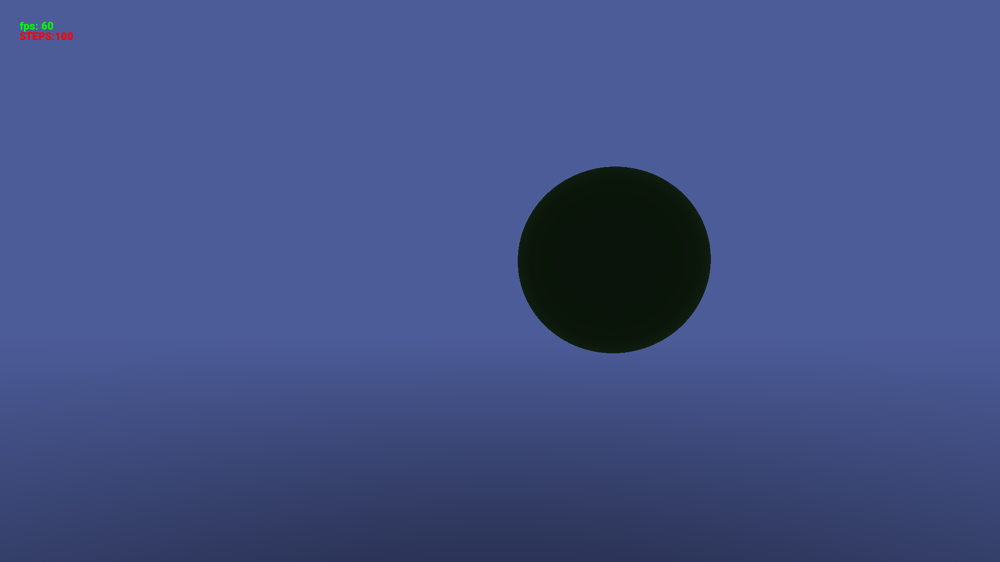
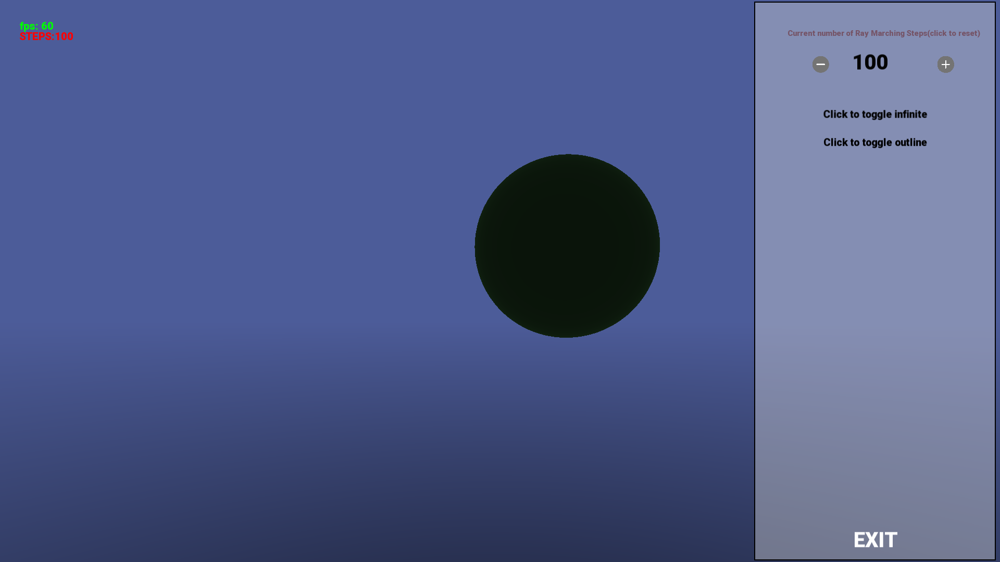
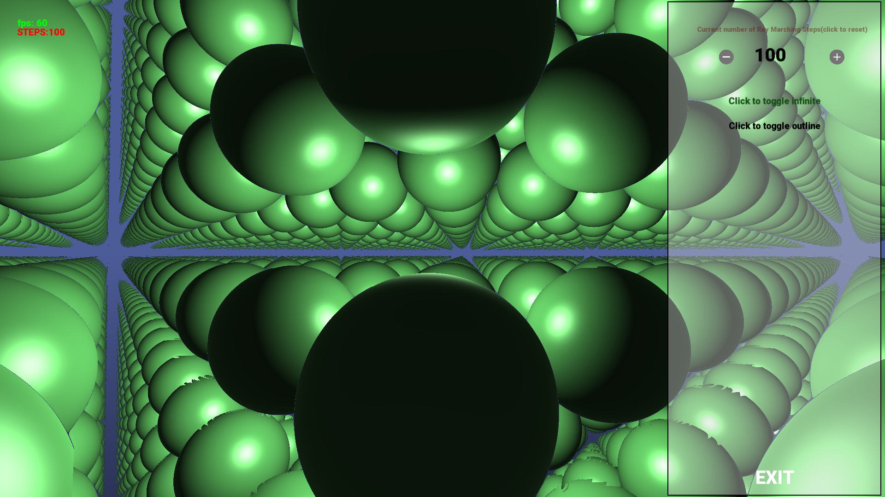
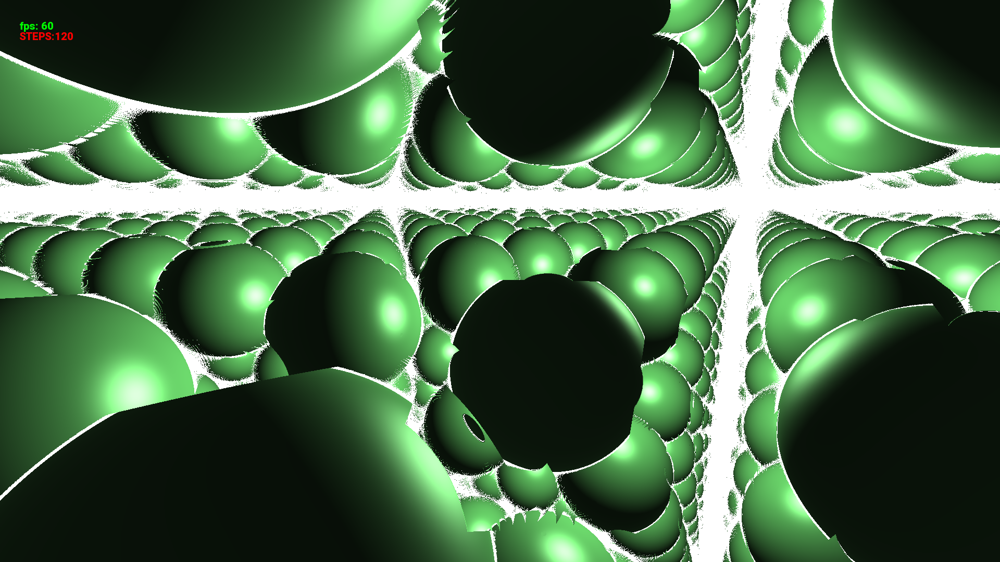

# RayMarcherEngine

**RayMarcherEngine** is a custom game engine built using **C++** and **OpenGL** with support from the **SFML** graphics library. The engine leverages the power of **ray marching** (also known as sphere tracing) to render stunning visuals with configurable performance and quality settings.

---

## ✨ Features:

- **Adjustable Ray March Steps**:  
  Fine-tune the number of ray marching steps to balance between performance and rendering quality.
- **Toggle Infinite Objects**:  
  Enable or disable infinite objects in the scene with the ability to outline them at no additional cost.
- **Custom UI Button Class**:  
  A fully customizable button class for designing user interfaces.

---

## 📸 Screenshots:

### Default:

### Menu:

### Object Outlining:

### Infinite Objects:

### Infinite Objects with Outlining:

---

## 📌 Credits:

- **Add icons**:  
  Created by [Pixel perfect - Flaticon](https://www.flaticon.com/free-icons/add)

- **Minus icons**:  
  Created by [Pixel perfect - Flaticon](https://www.flaticon.com/free-icons/minus)

---

Enjoy using **RayMarcherEngine** to explore the world of ray marching and real-time graphics!
