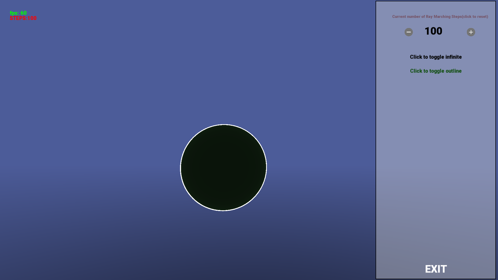

# RayMarcherEngine

**RayMarcherEngine** is a custom game engine built using **C++** and **OpenGL** with support from the **SFML** graphics library. The engine leverages the power of **ray marching** (also known as sphere tracing) to render stunning visuals with configurable performance and quality settings.

---

## ✨ Features:

- **Adjustable Ray March Steps**:  
  Fine-tune the number of ray marching steps to balance between performance and rendering quality.
- **Toggle Infinite Objects**:  
  Enable or disable infinite objects in the scene with the ability to outline them at no additional cost.
- **Custom UI Button Class**:  
  A fully customizable button class for designing user interfaces.

---

## 🛠️ Requirements:

To build and run the Engine, you'll need the following tools installed:

- **[CMAKE](https://cmake.org/download/)**:
  Along with a generator (mingw for windows, unix for unix-like operating systems)
- **[UDev](https://pkgs.org/download/libudev-devel)**
- **[OpenAL](https://www.openal.org/downloads/)**

---

## 🚀 Building and Running:

1. **Make a build directory**:

   ```bash
   mkdir build && cd build
   ```

2. **Configure CMake**:

   ```bash
   cmake .. -DCMAKE_INSTALL_PREFIX=${PWD}/install_dir -DCMAKE_C_COMPILER_LAUNCHER=ccache -DCMAKE_CXX_COMPILER_LAUNCHER=ccache -DCMAKE_EXPORT_COMPILE_COMMANDS=1
   ```

   _Here we are installing to {ProjectDir}/build/install_dir/, remove install prefix command_

3. **Build**:

   ```bash
   make -j8
   ```

4. **Install**:
   ```bash
   make install
   ```
5. **Run**:
   ```bash
   ./RayMarchEngine
   ```
   _You can change the rayMarch.frag file in the build diretory to change what is being displayed, play around with the fragment shader!_

## OR

1. Run to compile:
   ```bash
   ./compile.sh
   ```
2. Run to build:
   ```bash
   ./build.sh
   ```

---

## 📸 Screenshots:

### Default:


### Menu:


### Object Outlining:



### Infinite Objects:


### Infinite Objects with Outlining:


---

## 📌 Credits:

- **Add icons**:  
  Created by [Pixel perfect - Flaticon](https://www.flaticon.com/free-icons/add)

- **Minus icons**:  
  Created by [Pixel perfect - Flaticon](https://www.flaticon.com/free-icons/minus)
